# AvatarGen: AI-Powered Avatar Generator

## Project Overview
AvatarGen is a simple AI-powered avatar creation system designed as part of an AI/ML Intern assignment. It allows users to generate customizable digital avatars from text prompts or optional facial features via a web-based interface. The system leverages generative AI models like Stable Diffusion to create high-quality avatars in styles such as realistic, anime, cartoon, or cyberpunk.

Key features include:
- Text-to-avatar generation with prompt engineering.
- Optional face-guided generation using uploaded selfies.
- Multiple avatar variations with random seeds.
- Downloadable PNG outputs.
- Bonus features: Face-guided generation, random avatar generator, prompt auto-enhancer, and background remover.

This project demonstrates understanding of generative AI, Hugging Face Diffusers, and UI development with Gradio. **Note**: The entire project is implemented and runnable in Google Colab for easy access to free GPUs.

## Tech Stack
- **AI Model**: Stable Diffusion (v1.5 or SDXL), with options for ControlNet or IP-Adapter.
- **Framework**: PyTorch, Hugging Face Diffusers.
- **UI**: Gradio (for web interface).
- **Face Processing**: OpenCV, insightface (for optional face detection).
- **Deployment**: Google Colab (primary), Docker, or Hugging Face Spaces.
- **Language**: Python 3.9+.

## Phases
**Phase 1: Research & Setup**
1. Study Stable Diffusion and how it generates images from text.
2. Set up environment (Colab, local GPU, or cloud).
3. Run a basic text-to-image pipeline using Hugging Face Diffusers.
Deliverable: A Jupyter notebook demonstrating text-to-avatar generation with 3 sample prompts

- **Phase 2: Core Avatar Generator** -
- 1. Text-to-Avatar Pipeline
  ○ Use a fine-tuned model (e.g., stablediffusionapi/realistic-vision-v51 or Lykon/DreamShaper)
   ○ Add negative prompt to avoid blurry/low-quality outputs.
   ○ Allow control over:
   ■ Steps (30–50)
   ■ CFG Scale (7–12)
   ■ Seed (for reproducibility)
   2. Avatar Style Consistency
   ○ Enforce cartoon/anime/realistic style via prompt templates.
   ○ Example template: "A [style] avatar of [description], clean background, centered, high quality, detailed face"
   3. Random Variation Button
   ○ Generate 4 variations with same prompt, different seeds.

- **Phase 3: UI Development** -
Build a user interface using Gradio:
● Text input for prompt
● Dropdown for style: Realistic, Anime, Cartoon, Cyberpunk
● (Optional) File upload for reference face
● Generate button → Grid of 4 avatars
● Download button for selected avatar

**Phase 4: Bonus Features** -
Choose at least 2:
1. Face-Guided Generation (using IP-Adapter or ControlNet)
**2. Random Avatar Generator (no input → surprise avatar)**
3. Prompt Auto-Enhancer (use LLM to improve user prompts)
**4. Background Remover (using rembg)**
5. Dockerfile to containerize the app

## Setup Instructions
1. **Prerequisites**:
   - A Google account for Colab (recommended for GPU access).
   - No local setup needed—everything runs in the cloud.

2. **Run in Google Colab**:
   - Open the Colab notebook: **PHASE 2:** [AvatarGen Colab Link][[(https://colab.research.google.com/drive/your-notebook-id) ](https://colab.research.google.com/drive/1dhZIXNGKQ8xIPUvM1tocVkhjKrGD99Qt?usp=sharing)](https://colab.research.google.com/drive/106dbeJKo6kHAz18ZmiXheiQAP9EH0o_v?usp=sharing).
   - Click "Runtime" > "Run all" to install dependencies and launch the app.
   - The Gradio interface will appear in the output cell or as a public link.

3. **Usage**:
   - Input a text prompt (e.g., "A cyberpunk woman with blue hair").
   - Select a style from the dropdown.
   - (Optional) Upload a face image.
   - Click "Generate" to create 4 variations.
   - Download your favorite avatar.

## Screenshots
Here are visual examples, with a focus on Phase 1 (basic generation):

### Phase 1: Core (basic generation)
- 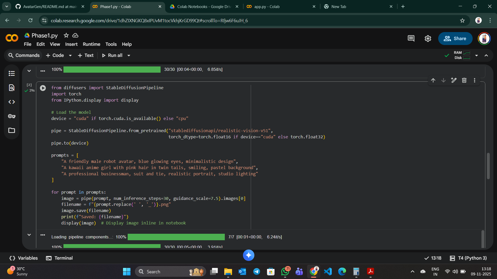  
  *Google Colab interface with code cells for installing dependencies and running the app.*

- 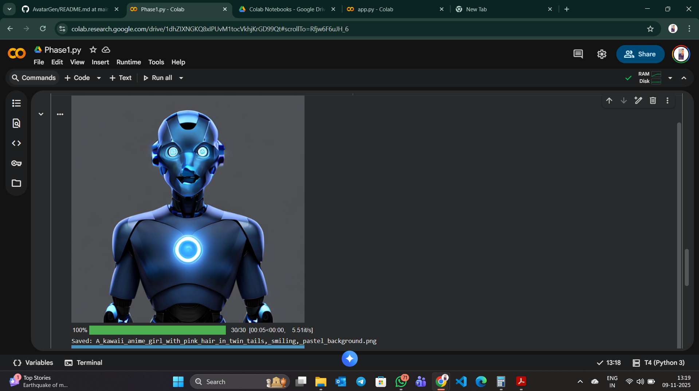  
  Example output from Phase 2: 3 avatar variations from a simple text prompt like "A smiling cartoon character."

- 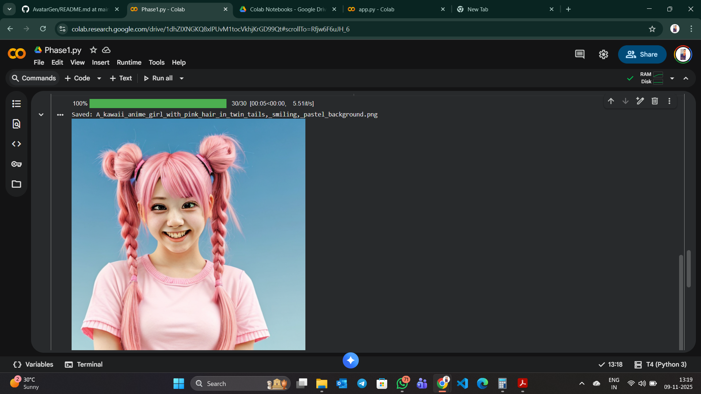  
  *Example output from Phase 2: 3 avatar variations from a simple text prompt like "A smiling cartoon character."*
  
  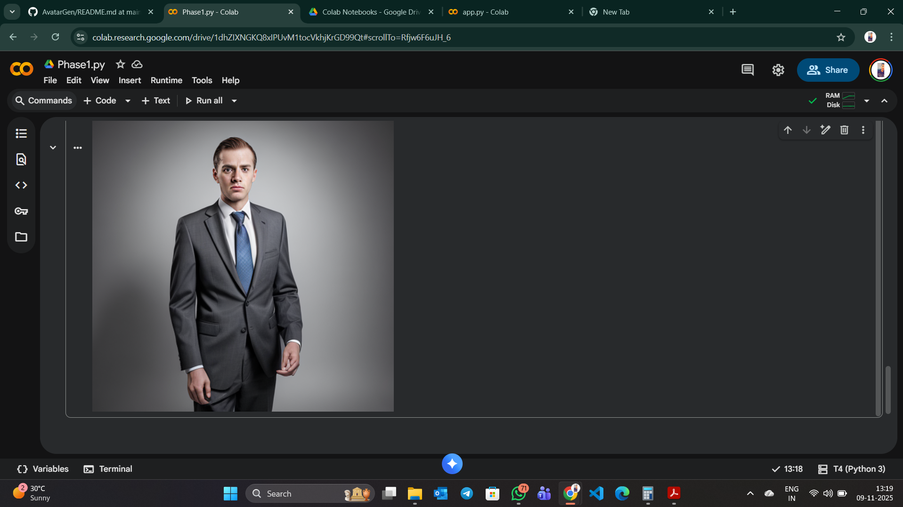  
  *Example output from Phase 2: 3 avatar variations from a simple text prompt like "A smiling cartoon character."*

### Phase 2: Core Avatar Generator

Phase 2: Core Avatar Generator
Implement the following features:
1. Text-to-Avatar Pipeline
○ Use a fine-tuned model (e.g., stablediffusionapi/realistic-vision-v51 or Lykon/DreamShaper)
○ Add negative prompt to avoid blurry/low-quality outputs.
○ Allow control over:
■ Steps (30–50)
■ CFG Scale (7–12)
■ Seed (for reproducibility)
2. Avatar Style Consistency
○ Enforce cartoon/anime/realistic style via prompt templates.
○ Example template: "A [style] avatar of [description], clean background, centered, high quality, detailed face"
3. Random Variation Button
○ Generate 4 variations with same prompt, different seeds.
Deliverable: Working Python script (avatar_gen.py) with a function generate_avatar(prompt, style, num_variants=4)

**Run in Google Colab**:
   - Open the Colab notebook: **PHASE 2:**
      **Run in Google Colab**:https://colab.research.google.com/drive/1FKnHLdWqEHFGjmaKz8Nxx9PwRcobNcwW?usp=sharing
     
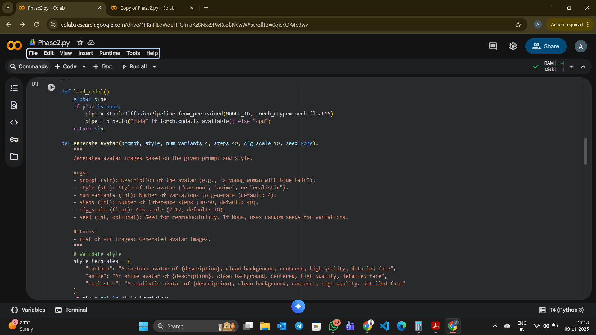  
  *Google Colab interface with code cells for installing dependencies and running the app.*

- 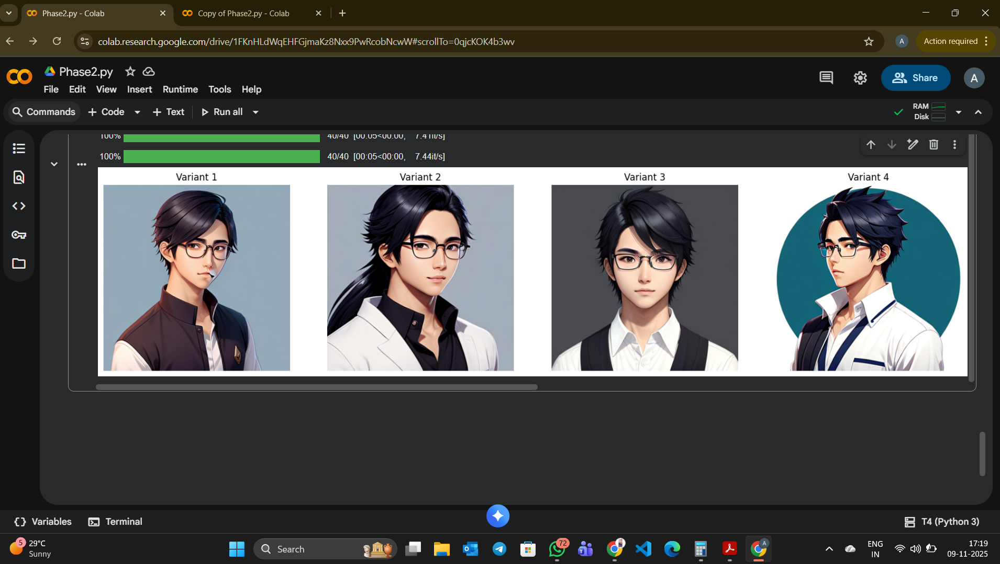  
  Example output from Phase 2: 3 avatar variations from a simple text prompt like "A smiling cartoon character."

**Phase 3: UI Development**
Build a user interface using Gradio:
● Text input for prompt
● Dropdown for style: Realistic, Anime, Cartoon, Cyberpunk
● (Optional) File upload for reference face
● Generate button → Grid of 4 avatars
● Download button for selected avatar
Deliverable: app.py with Gradio interface (shareable link via launch(share=True))

**Run in Google Colab**:
   - Open the Colab notebook: **PHASE 3:**
      **Run in Google Colab**:[https://colab.research.google.com/drive/1FKnHLdWqEHFGjmaKz8Nxx9PwRcobNcwW?usp=sharing](https://colab.research.google.com/drive/1EwVNp7J_xoKXku0jpm_-S2C6CE6p8jAC?usp=sharing)

gradio : https://b6e78b37f718b38011.gradio.live/

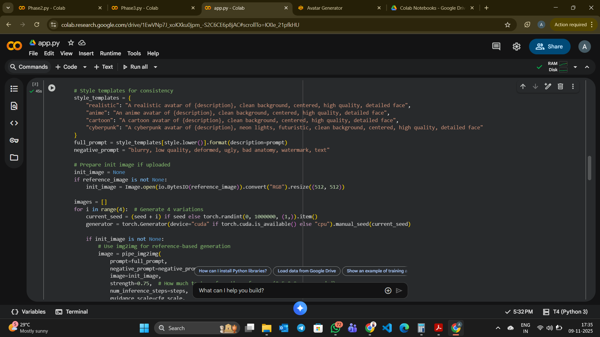  
  *Google Colab interface with code cells for installing dependencies and running the app.*

- 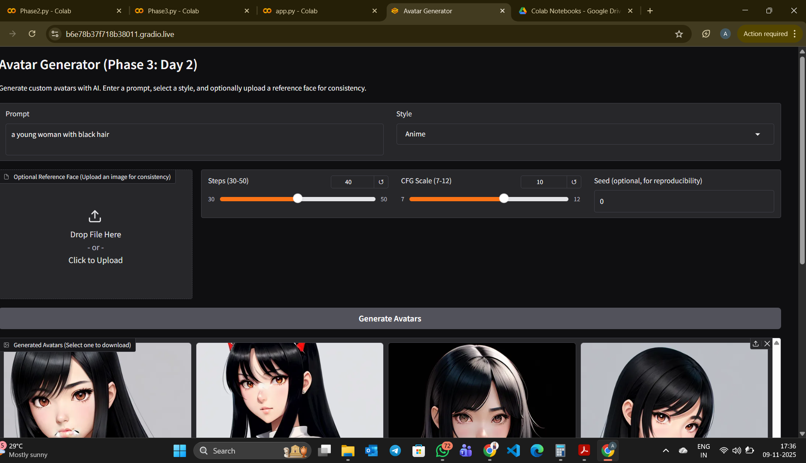  
  Example output from Phase 3: 4 avatar variations from a simple text prompt like "A smiling cartoon character.

- 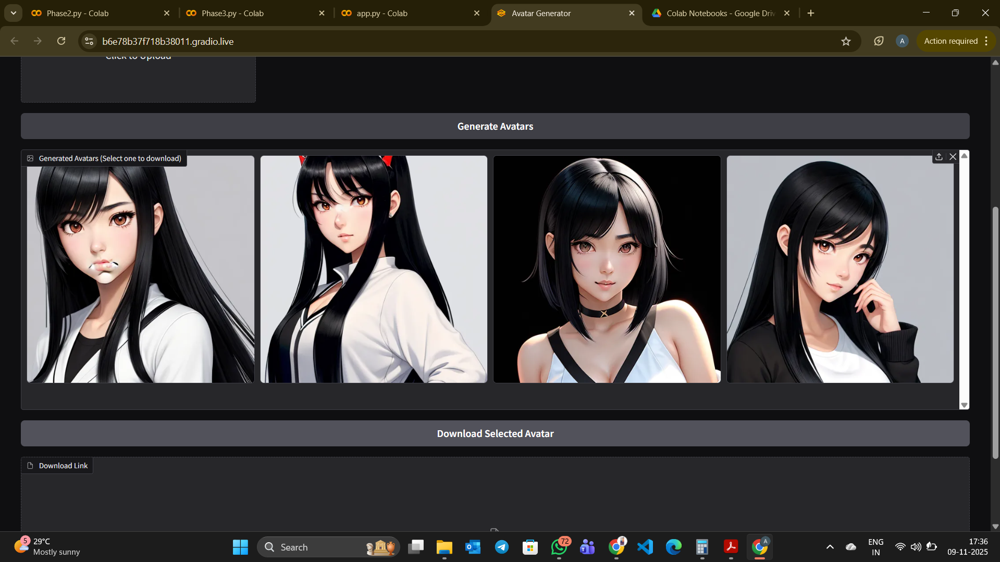  
  Example output from Phase 3: 4 avatar variations from a simple text prompt like "A smiling cartoon character.
**Phase 4: Bonus Features** -
Choose at least 2:
**2. Random Avatar Generator (no input → surprise avatar)**
**4. Background Remover (using rembg)**

 **2. Random Avatar Generator (no input → surprise avatar)**
**Run in Google Colab**:
   - Open the Colab notebook: **PHASE 4:**
      **Run in Google Colab**:https://colab.research.google.com/drive/10tlpLAFuJ8-LcIYcLcUwwCGyLdURpUNK?usp=sharing
     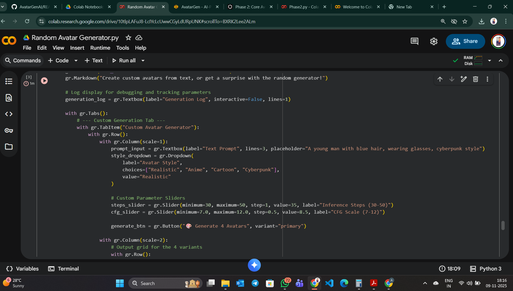  
  *Google Colab interface with code cells for installing dependencies and running the app.*

- 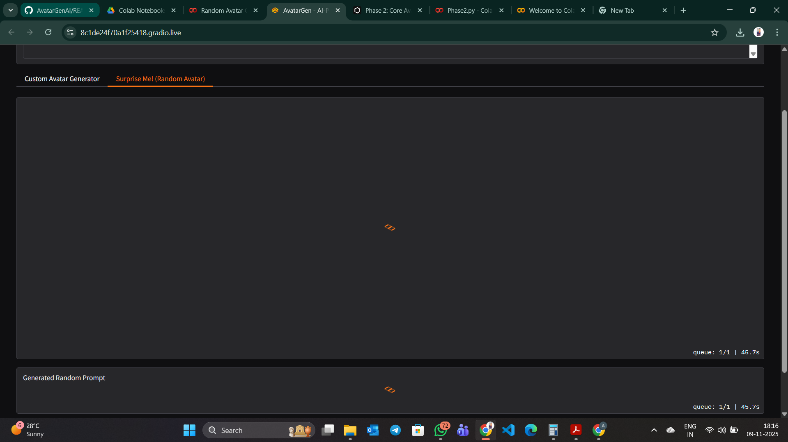  
  Example output from Phase 4:  avatar variations from a simple text prompt .
  
  - 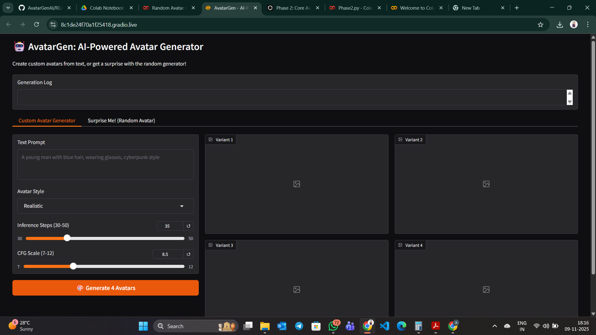

**4. Background Remover (using rembg)**
   - Open the Colab notebook: **PHASE 4:**
      **Run in Google Colab**: https://colab.research.google.com/drive/1PBcp9_s-GjUPd3OKKaOlmZChx8XRB9S8?usp=sharing
   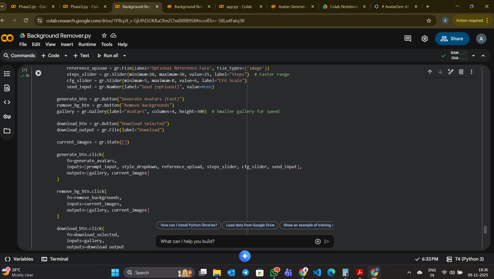  
  *Google Colab interface with code cells for installing dependencies and running the app.*

- 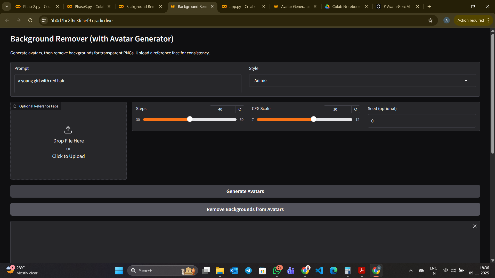  
  Example output from Phase 4:  avatar variations from a simple text prompt .
     

## Model Used & Why
- **Primary Model**: Stable Diffusion v1.5 (via Hugging Face Diffusers) for text-to-image generation. We chose this because it's open-source, efficient, and excels at creating diverse, high-quality images from prompts. For realism, we optionally use fine-tuned variants like `stablediffusionapi/realistic-vision-v51`.
- **Why?**: Stable Diffusion provides flexibility with prompt engineering, negative prompts, and parameters like CFG scale (7-12) and steps (30-50) for controlling output quality. It's lightweight compared to GANs and integrates well with Gradio for a user-friendly app. For face-guided features, we added IP-Adapter to blend user faces seamlessly without full fine-tuning.

## Challenges Faced
- **Model Loading and Performance**: Initial setup on local machines was slow due to large model sizes; resolved by using Hugging Face Spaces for cloud deployment.
- **Prompt Engineering**: Early outputs were inconsistent; mitigated with negative prompts (e.g., "blurry, low quality") and style templates.
- **Face Integration**: Aligning uploaded faces with generated avatars required experimenting with insightface and ControlNet, leading to occasional alignment issues.
- **UI Responsiveness**: Gradio's grid display for multiple images took time to optimize for fast generation (<10 seconds per image).
- **Deployment**: Dockerizing the app involved handling dependencies and GPU access, which was tricky on non-GPU systems.
- 

## Demo Video
Watch a 5-minute demo here: [Google Drive](https://drive.google.com/file/d/1Dfxu-ok7bSr3g__ac0ctFBscJro8fYaX/view?usp=sharing)).

## Repository Structure

## Evaluation Criteria Alignment
- **Functionality (30%)**: Core text-to-avatar generation works reliably.
- **Code Quality (20%)**: Clean, modular code with comments.
- **UI/UX (15%)**: Intuitive Gradio interface with fast loading.
- **Creativity (20%)**: Includes bonus features like face-guided generation.
- **Documentation (15%)**: Comprehensive README with visuals and setup.

## Sample Prompts
- "A friendly male robot avatar, blue glowing eyes, minimalistic design"
- "A kawaii anime girl with pink hair in twin tails, smiling, pastel background"
- "A professional businessman, suit and tie, realistic portrait, studio lighting"

## Resources
- [Hugging Face Diffusers](https://huggingface.co/docs/diffusers/index)
- [Gradio Docs](https://gradio.app/docs/)
- [Stable Diffusion WebUI Colab](https://colab.research.google.com/github/AUTOMATIC1111/stable-diffusion-webui/blob/master/launch.py)
